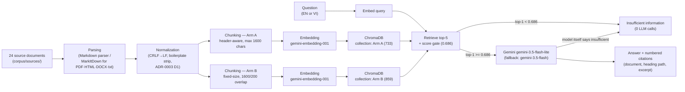

# Knowledge Assistant

A desktop RAG (Retrieval-Augmented Generation) assistant that answers questions about a fixed collection of 24
technical documents. Every answer is **grounded** in those documents and carries a **citation** (document + heading
path); when the collection does not contain the answer, the assistant says so explicitly instead of guessing. The
project also **measures** how well it works — a 36-question evaluation set scored on answer, retrieval, citation and
latency quality — and runs a **controlled experiment** comparing two chunking strategies with statistical tests, not
just a claim.

**Status:** feature-complete and evaluated; submission pending — the demo video is not yet recorded and the QC PR (#22) is merged on `main`. Final QC checks: [`docs/reports/execution/QC-001.md`](docs/reports/execution/QC-001.md); final report: [`docs/reports/milestones/final.md`](docs/reports/milestones/final.md).

## Problem

Generic chat with an LLM answers from its training data, not from a specific document set, and gives no way to check
whether an answer is actually supported by a source. For a fixed body of technical documentation (or regulations,
papers, internal docs, …) that is not good enough: an answer needs to be traceable to a passage, and the system needs
to be honest when the documents don't cover the question.

## Solution

Documents → Parsing → Chunking → Embedding → ChromaDB → Retrieval → Gemini → Answer + Citation (or an explicit
"insufficient information"). A retrieval-score gate refuses to call the LLM at all when the top match is too weak
(so a low-confidence guess never reaches the model), and the LLM itself is instructed to say so when the retrieved
passages don't answer the question. Every citation names the source document and heading path, never a page number
(these are Markdown pages, not paginated documents). The system answers in the question's language (English or
Vietnamese) while citation excerpts stay in the corpus's original English.

## Dataset

**What:** 24 English technical documentation pages about C#, .NET testing, ASP.NET Core and EF Core, saved as
Markdown. 22 are Microsoft Learn pages, #29 is a Microsoft docs page hosted on GitHub, and #15 is a Microsoft Q&A
thread. Questions to the assistant may be in English or Vietnamese; the documents stay English.

| | Count | Where |
|---|---|---|
| Original documents | 28 | IDs 1–29; **#25 never existed** (skipped during conversion) |
| Accepted (used by the assistant) | 24 | [`corpus/sources/`](corpus/sources/) |
| Excluded (never used) | 4 | [`corpus/excluded/`](corpus/excluded/): IDs 14, 19, 24, 27. They are index pages: mostly links to other pages, with no content useful to the assistant |

**Size:** about 1.2 million characters in total ([`corpus/manifest.json`](corpus/manifest.json)). Three pages are
huge: #23 Routing (381K), #17 Integration tests (258K) and #13 Handle errors (239K). Together they are 73% of all
text, because each repeats the same article once per ASP.NET Core version. Removing exactly repeated sections leaves
about 0.86 million characters. The smallest page is #09 (1.1K).

**Topics:**

| Group | IDs |
|---|---|
| C# language: types and reference | 04, 06, 07, 16, 18, 21, 26 |
| C# asynchronous programming | 01, 02 |
| C# overview and hub pages | 05, 08, 09, 20 |
| .NET testing | 03, 17, 28 |
| ASP.NET Core | 10, 11, 12, 13, 23, 29 |
| ASP.NET Core community Q&A | 15 |
| EF Core | 22 |

Details: [`docs/knowledge/domain/corpus-topic-map.md`](docs/knowledge/domain/corpus-topic-map.md); full manifest with
per-document SHA-256: [`corpus/manifest.json`](corpus/manifest.json).

**Files:**
- [`corpus/manifest.json`](corpus/manifest.json): one entry per accepted document (ID, title, source URL, size, SHA-256, heading counts).
- [`data/processed/documents/section-inventory.jsonl`](data/processed/documents/section-inventory.jsonl): every H1–H3 section with its heading path, line range and size.
- [`corpus/links.txt`](corpus/links.txt): the original URL for every original ID.
- Both generated files are rebuilt with `.venv/Scripts/python.exe scripts/utilities/build_corpus_inventory.py`. Don't edit them by hand.

**Rules:** source files are read-only originals and are never renumbered, edited or deleted. Excluded documents are
never used (confirmed by a script check of every `source_id` in the chunk, question and result files — QC-001).
Cleanup (removing page boilerplate, dropping duplicate chunks) happens in memory only.

## Architecture & workflow

Layers: presentation (PySide6 desktop GUI) → application (use cases) → core (interfaces + domain models) ←
infrastructure (parsers, chunkers, Gemini, ChromaDB). Core has no dependency on PySide6, ChromaDB or Gemini; enforced
by [`tests/unit/test_project_structure.py`](tests/unit/test_project_structure.py). Details:
[`docs/architecture/`](docs/architecture/).



**How to run** covers the CLI and the GUI below; both call the same `application` use cases (`composition.py` /
`wiring.py`), so results from `scripts/ask.py` and the GUI are identical for the same question and arm.

## How to run

Requires Python ≥ 3.10 and a free [Gemini API key](https://aistudio.google.com/). Tested on Windows: the current
866-test suite was verified on Python 3.13.3. Linux: the 104-test INGEST-003 suite ran on Python 3.13.12 and 3.11.15
([report](docs/reports/execution/INGEST-003.md)); the current suite has not been run on Linux.

```bash
# 1. Clone and create a virtual environment
git clone https://github.com/PotatoMine725/Tech-docs-RAG.git
cd Tech-docs-RAG
python -m venv .venv
# activate it — pick the line for your shell:
#   PowerShell:  .venv\Scripts\Activate.ps1
#   Git Bash:    source .venv/Scripts/activate
#   Linux/Mac:   source .venv/bin/activate

# 2. Install
pip install -r requirements.txt
pip install -e ".[dev]"       # editable install: makes `knowledge_assistant` importable (GUI, -m) and installs pytest
                               # (verified in QC-001's fresh-clone test: `pip install -r requirements.txt` alone
                               # is NOT enough for either the GUI launch command or `pytest`)

# 3. Configure
cp .env.example .env
# edit .env: set GEMINI_API_KEY
# On a low-memory Windows machine, keep OPENBLAS_NUM_THREADS=1 (already in .env.example) to avoid
# numpy/ChromaDB allocation failures.

# 4. Run the offline test suite (no API calls, no key required)
python -m pytest -q            # 866 passed, 1 deselected (a `@pytest.mark.gemini` live test)

# 5. Build the pipeline from scratch (skip this if you just want to run the pre-built index — see below)
python scripts/ingestion/normalize_corpus.py
python scripts/ingestion/build_chunks.py --arm A
python scripts/ingestion/build_chunks.py --arm B
python scripts/ingestion/build_index.py --arm A     # spends embedding quota unless texts are already cached
python scripts/ingestion/build_index.py --arm B

# 6. Ask a question from the CLI
python scripts/ask.py "What is dependency injection?" --arm A
python scripts/ask.py "Cách sử dụng async void trong C#?" --arm A --json

# 7. Launch the desktop GUI
python -m knowledge_assistant.presentation.desktop.app          # real app: needs GEMINI_API_KEY and a built index
python -m knowledge_assistant.presentation.desktop.app --fake    # offline demo, no key or index needed

# 8. Run the evaluation (spends Gemini quota; both arms, full mode, ~122 LLM + 36 embedding requests)
python scripts/evaluation/run_eval.py --arm A --mode full --split eval
python scripts/evaluation/run_eval.py --arm B --mode full --split eval
python scripts/evaluation/judge_run.py --run-id <run-id>          # after each run finishes, never concurrently
python scripts/evaluation/make_tables.py --runs <run-id-A> <run-id-B>   # regenerates docs/reports/epics/EPIC-05-evaluation.md
python scripts/experiments/compare_arms.py --run-a <run-id-A> --run-b <run-id-B> --report docs/reports/epics/EPIC-06-experiment.md
```

**0 quota when cached:** every embedding and every answer is cached to disk (`data/cache/embeddings.sqlite`,
`data/evaluation/results/`), keyed by text and settings. Re-running step 5 or 8 against the same texts/cases makes
**0** new API requests — confirmed in this project repeatedly (e.g. RAG-001b's re-runs, EVAL-003a's resume). What is
committed and what is not: `data/evaluation/results/` (21 files: the run files, tables and summaries behind the
evaluation and experiment reports) **is tracked**; only the contents of `data/chroma/` and all of `data/cache/` are
git-ignored (per-machine, rebuildable). A fresh clone therefore has the run files but no index and no cache: it must
run step 5 (embedding quota) to use the assistant. Step 8 is only needed to produce *new* runs; the reports can be
regenerated from the committed run files with `make_tables.py` and `compare_arms.py` (last two lines of step 8).

**Real gap found and fixed during QC-001's fresh-clone test:** `pip install -r requirements.txt` alone leaves
`knowledge_assistant` unimportable (no editable install) and does not install `pytest` (it is a `pyproject.toml`
`dev`-extra, not a runtime dependency) — so a fresh clone following only step 2's first line cannot run `python -m
knowledge_assistant...` or `pytest`. Fixed by documenting `pip install -e ".[dev]"` as part of step 2 (verified:
both gaps close, no code change needed).

## Evaluation summary

Full report, every number traced to its run file: **[`docs/reports/epics/EPIC-05-evaluation.md`](docs/reports/epics/EPIC-05-evaluation.md)**.
36 eval-split questions (32 answerable + 4 "not in the documents") × 2 chunking arms = 72 scored records
([`data/evaluation/questions/eval-v1.jsonl`](data/evaluation/questions/eval-v1.jsonl), frozen before any index was
built — tag `eval-freeze-v1`, [snapshot](docs/snapshots/evaluation/eval-v1.md)).

| | Lenient (headline) | Strict |
|---|---|---|
| **Answer accuracy** (63 labelled-answerable records) | **90.5 % (57/63)** correct + partially_correct | 73.0 % (46/63) correct only |
| **Retrieval, section_hit@5** | 0.938 | 0.938 |
| **Retrieval, section_hit@1** | 0.828 | 0.750 |

- **Refusal quality:** 8/8 unanswerable cases correctly refused, 0 hallucinations (`correct_refusal_rate` 1.000,
  `hallucination_rate` 0.000; [§ Refusal metrics](docs/reports/epics/EPIC-05-evaluation.md#refusal-metrics)). The
  retrieval-score gate itself refused 5 answerable-case × arm values before the LLM was ever called — these are
  scored `false_refusal`, not a hallucination: **Arm A** — Q-EVAL-001, Q-EVAL-016, Q-EVAL-018; **Arm B** —
  Q-EVAL-016, Q-EVAL-018.
- **Citation quality:** every answered answerable record cited the right source (`source_precision` 1.000,
  `presence_rate` 1.000, n=58); `section_precision` 0.977 (3 records cite the right document, wrong section);
  judge-checked support `support_rate` 0.974 (n=57) ([§ Citation metrics](docs/reports/epics/EPIC-05-evaluation.md#citation-metrics)).
- **Latency:** answer `generate` p50 1.5 s / p95 36.6 s / max 42.4 s across 61 generate calls (72 scored records; the
  other 11 made no generate call) — the tail is this project's own
  client-side per-minute request throttle queuing behind the free-tier rate cap, not provider slowness (verified
  against raw `throttle_wait` fields, not assumed) ([§ Latency](docs/reports/epics/EPIC-05-evaluation.md#latency)).
- **Judge reliability (owner spot-check, n=10, seed 42, stratified):** **8/10** rule-based agreement (Cohen's
  κ = 0.688), **9/10** holistic self-reported agreement — [§ Judge spot-check agreement](docs/reports/epics/EPIC-05-evaluation.md#judge-spot-check-agreement-owner).
  Judge format errors: **2 of 61** judge calls (both retries of the same case, Q-EVAL-002:B, which stays unlabelled)
  ([detail](docs/reports/epics/EPIC-05-evaluation.md#judge-spot-check-agreement-owner)).
- **Provider errors:** 0 × HTTP 429/5xx across ~158 requests in the frozen eval runs.

**Method for each metric** (answer, retrieval, citation, latency) is documented in
[`docs/specs/evaluation-spec.md`](docs/specs/evaluation-spec.md) and restated next to each table in the report above.

## Experiment summary

Full report: **[`docs/reports/epics/EPIC-06-experiment.md`](docs/reports/epics/EPIC-06-experiment.md)**. Compares
**Arm A** (header-aware chunking: splits on headings, max 1,600 chars, code/tables kept atomic) against **Arm B**
(fixed-size: 1,600-char windows, 200-char overlap, no regard for headings or code fences) — same corpus, same
embeddings model, same retrieval/generation pipeline, same 36 questions, paired statistics (McNemar test on
discordant pairs; 95% CI by paired bootstrap, 10,000 resamples).

> **One-line answer** (quoted from the report): *"On 36 questions, answer quality shows no statistically reliable
> difference between the arms. The measurable differences are in the chunks themselves: Arm B sends about 494 more
> prompt tokens per answer (reliable, p < 0.001); 45% of Arm B's chunks cut a code block, against 3% for Arm A; the
> two arms fail on different questions for different, traceable reasons."*

| Metric | Arm A | Arm B | Δ (B−A) | 95% CI | McNemar p | n |
|---|---|---|---|---|---|---|
| accuracy (strict) | 0.710 (22/31) | 0.742 (23/31) | +0.032 | [-0.097, 0.161] | 1.000 | 31 |
| evidence_hit@1 | 0.594 | 0.406 | -0.188 | [-0.406, 0.062] | 0.210 | 32 |
| prompt tokens/answer | — | +494 | — | — | **< 0.001** | — |
| chunks cutting a code fence | 3.27% (24/733) | 45.05% (387/859) | — | — | — | — |

**Why they differ / what was learned:** header-aware chunking (A) keeps a section, its code and its explanation in
one chunk (3% fence cuts); fixed-size chunking (B) cuts mid-block 14× as often (45%), which sometimes separates an
explanation from its code or a required fact from its citing chunk — but this shows up in chunk-level and
evidence-retrieval metrics, not reliably in final answer accuracy at n=31 (too few disagreements: accuracy has 5
discordant pairs, and even a 5–0 split would give McNemar p = 0.0625 — [see the report's
explanation](docs/reports/epics/EPIC-06-experiment.md#2-how-each-arm-was-evaluated)).

**Worked failure case — Q-EVAL-001** (gate refusal only on Arm A): both arms retrieve the exact same section
("Querying Data") at rank 1 with the same evidence, but Arm A's chunk (the 848-char section alone) scores **top-1
0.6779 < 0.686** and is refused by the gate, while Arm B's chunk (the section plus more of the page) scores **0.6908
≥ 0.686** and is answered correctly. The 0.686 gate threshold, tuned on Arm A's dev-set scores, sits between the two
— the gate decided this case, not retrieval quality
([detail](docs/reports/epics/EPIC-06-experiment.md#4-why-they-differ)).

**A note on two different accuracy figures you may see:** EPIC-05's per-arm `summary.json` accuracy (e.g. Arm A
23/32 = 0.719) is **unpaired** (one run per arm, no partner requirement); EPIC-06's McNemar table (Arm A 22/31 =
0.710) is **paired** (drops the one case with no same-question partner in the other arm, Q-EVAL-002:A). Both are
correct; they answer different questions (see
[EPIC-05 § Measurement limitations](docs/reports/epics/EPIC-05-evaluation.md#measurement-limitations)).

## Bonus

None of the optional bonus items (`BONUS-001`: hybrid search / query rewriting) were built — not reached before the
1 Oct deadline (`docs/plans/task-ledger.md` row 13, `not started`). The LLM judge (`scripts/evaluation/judge_run.py`)
is an automated-evaluation component built as part of the required evaluation pipeline, not a separate bonus effort,
though it does count toward the brief's "automated evaluation" bonus category.

## AI usage

Built with Claude Code (CLI) across every task; a planning assistant (Claude in the Claude desktop app, Cowork) broke
the brief into tasks, wrote the task prompts, addenda and verify prompts, analysed reports and verifier verdicts, and
advised the owner, who made every final call; GitNexus was used for impact analysis and change detection. Full tool table, per-task log of what AI did and got wrong (with how each mistake was found and
fixed), and the "with 7 more days" plan: **[`AI_WORKLOG.md`](AI_WORKLOG.md)**.

## Completed work

All planned epics reached their exit gates (`docs/plans/master-plan.md` §4, `docs/plans/task-ledger.md`):

- **EPIC-01 Corpus analysis** — manifest, section inventory, topic map (G1 ✅).
- **EPIC-02 Ingestion** — Markdown + MarkItDown parsing, normalization, both chunkers, per-arm stats (G2 ✅).
- **EPIC-03 RAG baseline** — Gemini embedder + cache, ChromaDB (both arms indexed), retrieval + generation +
  citations, retry/fallback/resilience, CLI (G3 ✅).
- **EPIC-04 Desktop GUI** — PySide6 window: question, answer, citations, insufficient-information state, busy/error
  states (G4 ✅, owner-checked).
- **EPIC-05 Evaluation** — 36-question frozen ground truth (M1), resumable runner, metrics, LLM judge with owner
  spot-check, full report (G5A/G5B ✅).
- **EPIC-06 Experiment** — Arm A vs Arm B, paired statistics, failure analysis against every predicted failure mode
  (G6 ✅).
- **EPIC-07 Final QC** (this document) — README, `AI_WORKLOG.md`, traceability, final checks, demo script (G7, see
  [final report](docs/reports/execution/QC-001.md)).

Each task was independently verified in a fresh session (`agents/prompts/99-VERIFY.md`), with two exceptions:
QC-001 started while ledger rows 11 and 12 were not yet plain `verified`, and QC-001 itself is under re-verify.
Verdicts and fix history are in [`docs/plans/task-ledger.md`](docs/plans/task-ledger.md).

## Limitations

- **Not yet done:** the demo video is not recorded (script only), and the QC-001 work is not on `main` — PR #22
  (`qc-001` → `dev`) and PR #23 (`dev` → `main`) are unmerged drafts awaiting re-verify and the owner's approval.
- **n = 36** evaluation questions (32 answerable + 4 unanswerable). Each individual case is worth roughly 1.6–2.8
  percentage points of a headline rate — small movements can be one or two cases flipping, not a real capability
  change ([detail](docs/reports/epics/EPIC-05-evaluation.md#measurement-limitations)).
- **The retrieval-score gate threshold (0.686) was tuned on only 6 dev questions, and on Arm A only** — it is not
  re-tuned per arm, which is exactly what produces the Q-EVAL-001 worked case above (the same evidence scores
  differently under the two chunkers, and one threshold cannot fit both) (`docs/reports/epics/EPIC-06-experiment.md`, OD-9).
- **The judge is the same model family as the answer model** (`gemini-3.5-flash-lite` both sides) — a self-preference
  risk, mitigated but not removed by the owner's blind spot-check (n=10, 8/10 agreement); this is a small sample of
  a systemic risk, not proof the risk is absent elsewhere.
- **Free-tier quotas** shaped the evaluation design throughout (single run per arm, no repeat-run variance estimate,
  throttled request pacing visible in the latency tail) — see `docs/plans/master-plan.md` §5.
- **Vietnamese questions are asked against an English-only corpus.** Cross-lingual retrieval and citation excerpts
  (always in the corpus's original English) were designed for and tested against this setup; a differently-typed VI
  question without diacritics would be misclassified as English by the heuristic language detector
  (`application/common/language.py`).
- **No real HTTP 429/503 was observed** in any run in this project — retry/backoff/fallback logic is unit-tested and
  exercised in principle (mutation-tested), but never proven against a real provider failure.
- **Converted formats (PDF, HTML, DOCX, txt) skip MarkItDown's post-clean-up** (owner-accepted, OWNER-001; the
  current corpus is all Markdown, so this affects only a future non-Markdown corpus): trailing spaces per line are
  kept, 3+ blank lines are not collapsed, and a converted PDF can end with a form-feed line. Chunk offsets stay
  exact.
- **Binary content in a `.txt` file is read as text** (owner-accepted, OWNER-001) — no format sniffing for plain
  text beyond the per-format spot-check rule.
- **One flaky test observed once, never reproduced.** `tests/unit/infrastructure/test_chroma_store.py::test_top_k_larger_than_the_collection_returns_everything`
  failed once inside a full-suite run with `InternalError: Error in compaction` (noted in EVAL-004b's verify). QC-001
  ran it 5× isolated, 5× as its whole module, and 5× as the full 866-test suite — **15/15 passes, 0 reproductions**.
  Left in place, undocumented root cause (a chromadb-internal HNSW segment/compaction timing issue is suspected but
  not confirmed); see [`docs/reports/execution/QC-001.md`](docs/reports/execution/QC-001.md) for the attempts.

## Future work

The clearest next step beyond the 7-more-days list (`AI_WORKLOG.md`) is **user-uploaded documents**: letting someone
add their own files instead of only querying the fixed 24-document corpus. That would require, at minimum:
- an ingestion path for arbitrary uploads (format detection, size/type limits, the same parse → normalize → chunk →
  embed pipeline this project already has, but running on demand instead of as a batch build);
- document management (list, remove, re-index a document without rebuilding the whole collection);
- page-level citations for formats that don't have Markdown-style headings (a PDF page number, not a heading path —
  a different `location_type` from the one this project uses throughout);
- no ground truth: an uploaded document has no pre-written evaluation questions or expected answers, so answer
  quality for it can't be measured the way this project measures the fixed corpus — at best, retrieval/citation
  soundness checks without a labelled "correct answer";
- **prompt injection from document contents** — text inside an uploaded file could contain instructions aimed at the
  LLM (e.g. "ignore previous instructions and..."), which this project's fixed, curated, read-only corpus never had
  to defend against;
- privacy — uploaded documents may be private to the uploader and must not leak into another user's answers or into
  any shared cache/index.

## Working product

This is a **desktop application**, not a hosted web service — there is no public URL to click. It is demonstrated by:
- **Running it yourself:** see "How to run" above (`python scripts/ask.py ...` for the CLI, `python -m
  knowledge_assistant.presentation.desktop.app` for the GUI).
- **Demo video** (≤ 5 min): script at [`docs/reports/milestones/demo-video-script.md`](docs/reports/milestones/demo-video-script.md);
  video link: _added here once the owner records it_.
- **GitHub repository:** [github.com/PotatoMine725/Tech-docs-RAG](https://github.com/PotatoMine725/Tech-docs-RAG).

## Repo map

```
agents/       task prompts and role/skill definitions the AI worked from
config/       chunking params, prompt templates, pricing table, GUI messages
corpus/       read-only source documents (sources/ accepted, excluded/ dropped)
data/         generated artifacts: processed docs/chunks, evaluation questions/results, experiments, cache (git-ignored where per-machine)
docs/         specs (WHAT/WHY), architecture (HOW), plans (WILL), reports (HAPPENED), reviews (QUALITY), knowledge (DISTILLED), snapshots (POINT-IN-TIME), prompt-log (HISTORY)
scripts/      CLI entry points: ingestion, evaluation, experiments, generation, utilities
src/          the application: presentation (GUI) / application (use cases) / core (interfaces, models) / infrastructure (Gemini, ChromaDB, parsers)
tests/        offline unit/layer tests; `@pytest.mark.gemini` live tests (excluded by default)
validation/   hand/spot-check evidence: G2 checks, smoke checks, judge spot-check sheets
```

Full project constitution: [`CLAUDE.md`](CLAUDE.md). Full plan and gate history: [`docs/plans/master-plan.md`](docs/plans/master-plan.md).
