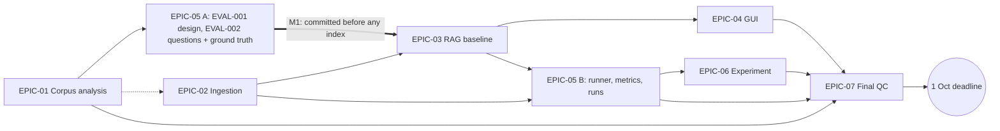

# Master plan

**Status:** plan only, written 2026-09-24. Nothing below is implemented. Dates are targets, not results.
**Decisions:** taken from CLAUDE.md and ADR-0001…0004. This plan does not change any decision; anything still open is listed in [§8 Open decisions](#8-open-decisions-decision-required).
**Keep it current:** task status lives only in the [task ledger](task-ledger.md); this plan links to it instead of repeating statuses. Gate checkboxes stay here. Results go in `docs/reports/`, not here (plans = WILL).
**Workflow (synced to the prompt set by REORIENT-001, 2026-09-24):** every task is one prompt file in `agents/prompts/` (order: `agents/prompts/README.md`), and every task is followed by `99-VERIFY.md` in a fresh session. **A task starts only when its prerequisites are `verified` in the [ledger](task-ledger.md).**

> 🔴 **CRITICAL DEADLINE: Thursday 2026-10-01 — final submission of the whole project.**
> Internal target: **submission-ready by Wednesday 30 Sep, end of day**. 1 Oct is a buffer day for fixes only (no new features).
> Time of day and submission channel on 1 Oct: unknown (OD-1).

## 0. How to read this plan

| Word | Meaning here |
|---|---|
| Phase | A stage of the project (e.g. "build the pipeline"). A phase contains one or more epics. |
| Epic | A big chunk of work with its own file in `docs/plans/epics/`. |
| Task | One prompt file in `agents/prompts/` (e.g. `01-EVAL-001-…` = EVAL-001). Task IDs below are the prompt files' IDs; status per task: [ledger](task-ledger.md). |
| VERIFY | `99-VERIFY.md`, run after every task in a new session; its verdict sets the task to `verified` in the ledger. |
| Exit gate (G1…G7) | A checklist that must pass before work that depends on this epic starts. |
| Milestone (M1…M3) | A key moment on the timeline, e.g. "ground truth frozen". |
| Arm | One side of the experiment: Arm A = header-aware chunking (baseline), Arm B = fixed-size chunking (ADR-0003 D7). |
| Ground truth | The expected answer and the expected source (document + heading path) for each test question. |
| Quota day | Gemini free-tier daily limits reset at midnight Pacific time = **14:00 your time (UTC+7)**. A quota day runs 14:00 → 14:00. |

## 1. Phases

| Phase | Dates (target) | What happens (plain words) | Epics | Status |
|---|---|---|---|---|
| 0 Setup & decisions | 24 Sep | Folder structure, stack, chunking and model decisions | SETUP-001, ADR-0001…0004 | **Done** (commits `3d5a606`, `490068f`, `6f9e1d5`) |
| 1 Know the data | 24–25 Sep | Understand the 24 documents; write the test questions and their correct answers **before** building anything that could bias them | CORPUS-001, HOUSE-001, REORIENT-001, EVAL-001, EVAL-002 | [ledger](task-ledger.md) |
| 2 Build the pipeline | 25–27 Sep | Read → clean → chunk → embed → store → retrieve → answer with citations | INGEST-001…003, RAG-001a/b, RAG-002, RAG-003 | [ledger](task-ledger.md) |
| 3 Measure & prove | 28–30 Sep | Run the questions through both arms, score them, explain the differences; build the desktop window alongside | EVAL-003a/b/c, EVAL-004, EXP-001, GUI-001 (BONUS-001 optional) | [ledger](task-ledger.md) |
| 4 Finish & submit | 30 Sep–1 Oct | README, final checks against the brief, submit | QC-001 | [ledger](task-ledger.md) |

## 2. Day-by-day timeline (targets)

| Date | Main work | Gate / milestone |
|---|---|---|
Real position (REORIENT-001, 2026-09-24): CORPUS-001, HOUSE-001 and EVAL-001 finished on 24 Sep. EVAL-001 was originally planned to end with the question freeze on 26 Sep, so the plan is about a day ahead. The rows below follow the target dates in `agents/prompts/README.md`. "VERIFY" = `99-VERIFY.md` for the task just finished. Actual status: [ledger](task-ledger.md).

| Date | Main work (task IDs = prompt files) | Gate / milestone |
|---|---|---|
| Thu 24 Sep | Master plan. CORPUS-001 (EPIC-01), HOUSE-001 + VERIFY (ACCEPT), EVAL-001 + VERIFY (ACCEPT WITH FIXES) + fixes, REORIENT-001. | **G1** ✅ |
| Fri 25 Sep | Owner fills the EVAL-001 re-check sheet; VERIFY EVAL-001 again; VERIFY REORIENT-001. Then EVAL-002 (write + freeze, tag `eval-freeze-v1`) and, in parallel, INGEST-001 (models, parser, normalization). Answer OD-1. | **M1 ground truth frozen** |
| Sat 26 Sep | INGEST-002 (both chunkers + stats), INGEST-003 (MarkItDown, cuttable). RAG-001a (embedder + cache, V-1 probe, ADR-0005), then RAG-001b (Chroma; index Arm A before 14:00 and Arm B after 14:00 if quota needs two quota days). | **G2** |
| Sun 27 Sep | Finish RAG-001b indexing. RAG-002 (retrieval, generation, citations, "insufficient information"; dev-set threshold). RAG-003 (retry/fallback, CLI, smoke checks). | **M2 first end-to-end answer** ✅ *(reached 26 Sep: RAG-002 verified, first grounded answers with heading-path citations on the dev set; G3 evidence completed by RAG-003 on 26 Sep, pending its 99-VERIFY)*, **G3** |
| Mon 28 Sep | EVAL-003a (runner), EVAL-003b (metrics + judge), EVAL-003c (tables + spot-check tools), offline tests. GUI-001 in parallel. EVAL-004 starts: retrieval-only metrics for both arms (embeddings only, cheap), dry run of 3 questions after 14:00. | **G4** |
| Tue 29 Sep | EVAL-004: full answer + judge run, both arms; after 14:00 fresh quota → re-run slot if needed; judge spot-check; evaluation report. EXP-001 (experiment + failure analysis). | **G5B** |
| Wed 30 Sep | Finish EXP-001. BONUS-001 only if time remains (after M3 rule). QC-001 (README, AI_WORKLOG, final checks, video script). After 14:00: last quota day for small fixes. | **G6**, **M3 submission-ready** |
| Thu 1 Oct | 🔴 **DEADLINE.** QC fixes only, final commit, submit. | **G7** |

## 3. Dependencies

| Epic | Needs first | Why |
|---|---|---|
| EPIC-01 | Phase 0 (done) | — |
| EPIC-02 | EPIC-01 (soft) | Boilerplate list for normalization; can start in parallel |
| EPIC-05 stage A | EPIC-01 | Needs the section inventory (heading paths) to write ground truth |
| EPIC-03 | EPIC-02 **and M1** | Needs chunks to embed. **No index may be built before ground truth is committed** (CLAUDE.md rule 9, ADR-0003 D8) |
| EPIC-04 | EPIC-03 | The window calls the application "ask a question" use case |
| EPIC-05 stage B | EPIC-02, EPIC-03 | Runner calls the pipeline; section hit@5 needs normalized text offsets |
| EPIC-06 | EPIC-05 stage B | Same runner and metrics score both arms |
| EPIC-07 | EPIC-01, 04, 05B, 06 | README and final checks need everything else |

**Critical path** (a delay here delays the deadline): CORPUS-001 → EVAL-001 → owner re-check + re-VERIFY → EVAL-002 freeze (M1) → RAG-001a/b indexing (also needs INGEST-002) → RAG-002 → RAG-003 → EVAL-003a/b/c → EVAL-004 → EXP-001 → QC-001 → 1 Oct. Each arrow includes the `99-VERIFY` of the task before it.
EPIC-04 (GUI) is off the critical path: build it while evaluation runs or waits for quota.

## 4. Epics

### EPIC-01 Corpus analysis
**Status:** [ledger](task-ledger.md) · G1 passed — [report](../reports/epics/EPIC-01-corpus-analysis.md). OD-3 closed the same day.
**When:** Thu 24 Sep (done before the prompt set) · **Phase:** 1 · **Task:** CORPUS-001 (no prompt file) · **Roles:** corpus-analyst, knowledge-map-analyst
**Goal:** know exactly what is in the 24 documents, so the test questions are good and the dataset can be described in the README.

Deliverables:
- Corpus manifest for the 24 accepted docs: source_id, title, source URL, file name, size, SHA-256 (format/location: OD-2).
- Section inventory: every heading path per doc using the ADR-0003 D2 convention (page's own H1 > H2 > H3), with section sizes and version-variant counts → `data/processed/`. Headings are detected **outside code fences only** (many code blocks contain `# comment` lines that are not headings), using the same rule the EPIC-02 chunker will use.
- Topic map (which doc covers which topics; small vs huge docs) → `docs/knowledge/domain/`.
- Dataset description draft for the root README (what, how many, where from, why 4 are excluded — OD-3).
- Epic report → `docs/reports/epics/`.

Exit gate **G1**:
- [x] Manifest has exactly 24 IDs; none of 14, 19, 24, 27; no #25.
- [x] Checksums match `docs/snapshots/corpus/` (sources unmodified).
- [x] Section inventory covers all 24 docs.
- [x] README dataset-description draft exists.
- [x] `.venv/Scripts/python.exe -m pytest` passes.

### EPIC-02 Ingestion pipeline
**When:** Fri 25 – Sat 26 Sep · **Phase:** 2 · **Tasks:** INGEST-001 (`03`, models + parser + normalization), INGEST-002 (`04`, both chunkers + stats), INGEST-003 (`05`, MarkItDown adapter, cuttable) · **Role:** ingestion-analyst
**Goal:** turn each document into clean, well-labelled chunks, in two ways (Arm A and Arm B).

Deliverables:
- Core models filled in per ADR-0003 D6 (`DocumentChunk` fields, `ParsedDocument` text + metadata); core stays free of Chroma/Gemini/format code.
- Markdown parser via `ParserRegistry`; normalization step (ADR-0003 D1) in infrastructure. The normalizer MUST convert `\r\n` → `\n` **before** computing character offsets and hashes, so results don't depend on how a checkout stores line endings (HOUSE-001). The corpus snapshot hashes in `docs/snapshots/corpus/` are of the original CRLF bytes; `corpus/manifest.json` uses LF (`sha256_lf`).
- Header-aware chunker (D2–D5) and fixed-size chunker (D7: 1,600 chars, 200 overlap), same metadata from both.
- Chunk files per arm → `data/processed/chunks/`; per-arm stats (chunk count, size distribution, % chunks cutting a code fence; D8).
- MarkItDown adapter for non-Markdown files (ADR-0002), scheduled **after** the chunkers because the current corpus is all Markdown; includes V-2 (Python 3.13 check) and adding it to `pyproject.toml`.
- Offline unit tests: deterministic IDs, size rules, code/table blocks kept whole, heading paths, no `markitdown` import in core/application.

Exit gate **G2**:
- [x] Both chunkers run over all 24 docs; a second run gives identical chunk IDs and hashes. *(INGEST-002, `validation/ingestion/g2-check.md`; verified 2026-09-25)*
- [x] Chunk IDs follow `{source_id}:{chunker_config}:{index:04d}`. *(INGEST-002)*
- [x] For all 24 docs: every heading path in the Arm A chunk file appears in the EPIC-01 section inventory, and every inventory heading path can be located in the normalized text (so its character span can be computed for section hit@5). This guarantees the frozen ground truth points at real sections. *(Second half met by INGEST-001: 636/636 inventory sections located, `test_every_inventory_heading_path_has_a_span_in_the_normalized_text`; Arm A half met by INGEST-002: `check_g2.py`, 752/752 chunks; re-run after INGEST-004 (ADR-0003 D3a): 733/733.)*
- [x] Stats file exists for each arm. *(`data/processed/chunks/stats-arm-{a,b}.json`)*
- [x] ~5 chunks per arm spot-checked by hand, notes in `validation/ingestion/`. *(`spot-check.md`)*
- [x] pytest passes, including `tests/unit/test_project_structure.py`. *(92 passed, Linux)*

G2 passed: `99-VERIFY` for INGEST-002 → ACCEPT (2026-09-25, [review](../reviews/code/INGEST-002-verify.md)).

INGEST-004 (ADR-0003 D3a, owner 2026-09-25): Arm A drops heading-only chunks (752 → 733). Arm B is byte-identical. G2 was re-run and passes 11/11. Every blueprint expected/alternate section keeps ≥ 1 Arm A chunk. Status `verified` 2026-09-25 (ACCEPT; follow-up fixes `f456471`; merged into `dev` `5c2cace`). EVAL-002 is unblocked ([ledger](task-ledger.md) rows 02, 04a).

### EPIC-03 RAG baseline
**When:** Sat 26 – Sun 27 Sep · **Phase:** 2 · **Entry condition:** M1 committed · **Tasks:** RAG-001a (`06a`, embedder + cache + ADR-0005), RAG-001b (`06b`, ChromaDB + indexing), RAG-002 (`07`, retrieval + generation + citations), RAG-003 (`08`, retry/fallback + CLI + smoke) · **Role:** rag-analyst
**Goal:** ask a question, get a grounded answer with citations — or an honest "not enough information".

Deliverables:
- **First step:** V-1 — check how a batched embedding request counts against the daily limit. This decides whether indexing takes one or two quota days. ✅ Answered 26 Sep (RAG-001a, ADR-0005): each text counts as one request → two quota days.
- Decide OD-7…OD-11 before building indexes. (OD-7, OD-8 decided 26 Sep in ADR-0005; OD-9, OD-10 decided 26 Sep in RAG-002; OD-11 decided 26 Sep by the owner in the RAG-003 addendum, recorded in the ADR-0004 amendment.)
- Embedder: `gemini-embedding-001`, task types `RETRIEVAL_DOCUMENT` (chunks) / `RETRIEVAL_QUERY` (questions), batched and throttled to the per-minute token limit; save embeddings to disk so quota is never spent twice on the same text.
- ChromaDB adapter; one collection per arm; **both arms indexed now** (uses embedding quota early).
- Retrieval use case (top-k = 5).
- Generation use case: answer only from retrieved chunks, in the question's language; "insufficient information" message in the question's language.
- Citations: document name + heading path (`location_type = "heading"`), excerpt in original English.
- Gemini adapter: `gemini-3.5-flash-lite`, retry with backoff on 503/429, fallback `gemini-3.5-flash`, records model used and retry count (ADR-0004 D11–D13). Model names in configuration only.
- A command-line script to ask one question end to end (`scripts/`).
- Tests: offline tests with fake embedder/LLM/store; live tests marked `@pytest.mark.gemini`.

Exit gate **G3** (M2 is the first successful end-to-end answer):
- [x] For both arms, number of items in the Chroma collection = number of chunks in the chunk file. (RAG-001b, 26 Sep: Arm A 733 = 733, Arm B 859 = 859; re-runs 0 new / 0 API. The store is in `data/chroma/` (ADR-0005 D16); it was rebuilt there from the embedding cache with 0 API requests after the owner fixed `.env`.)
- [x] Smoke checks saved in `validation/` (labelled "smoke check, not evaluation data"): 1 English + 1 Vietnamese question answered with heading-path citations; 1 out-of-corpus question gets the "insufficient information" message. (RAG-003, 26 Sep: [smoke-2026-09-26](../../validation/generation/smoke-2026-09-26.md), 4 LLM + 0 embedding requests; pending 99-VERIFY.)
- [x] No API key in code, logs or output (secret scan); model names only in config. (RAG-003, 26 Sep: scan 0 matches; test that no model name is in `src/` outside `config.py`; pending 99-VERIFY.)
- [x] Offline pytest passes; `-m gemini` tests pass when run on purpose. (RAG-003, 26 Sep: 546 passed; `-m gemini` 1 passed on cached vectors, 0 requests; there is no LLM `-m gemini` test, the LLM live check is the smoke script; pending 99-VERIFY.)

### EPIC-04 Knowledge assistant (desktop GUI)
**When:** Mon 28 – Tue 29 Sep · **Phase:** 3 · **Task:** GUI-001 (`10`)
**Goal:** a simple PySide6 window a person can actually use. Minimal but required (the stack is locked in CLAUDE.md).

Deliverables:
- Window with: question box, answer area, citations list (document, heading path, excerpt), clear "insufficient information" state, busy and error states (e.g. quota/503 message). The window stays responsive while waiting for Gemini.
- Calls application use cases only: no parsing, Chroma, Gemini, retrieval or evaluation code in the GUI (gui-architecture.md). Uses the baseline Arm A.
- Offline tests for the view-model logic.
- Extra features beyond this: OD-14.

Exit gate **G4**:
- [ ] Launches from one documented command.
- [ ] Checked by hand: 1 English answer, 1 Vietnamese answer, 1 "insufficient information" case.
- [ ] Layer tests pass.

### EPIC-05 Evaluation
Two stages, because the questions must be frozen before indexing, but scoring needs the finished pipeline. **Role:** evaluation-designer.

**Stage A — evaluation dataset.** **When:** Thu 24 – Fri 25 Sep · **Phase:** 1 · **Tasks:**
- **EVAL-001 Design evaluation dataset** (`01` + the full prompt in `docs/prompt-log/claude-code/`): the design only. Question mix (OD-4), coverage plan, answer rubric and "result" values (OD-5). No final questions yet.
- **EVAL-002 Write and freeze the dataset** (`02`): write the ≥ 30 questions + ground truth following the EVAL-001 design, then commit (M1). *Status 2026-09-26: **done, M1 reached.** Owner approved the review sheet (with wording fixes 024/017/028 and G1); merged into `dev` (PR #8); tag `eval-freeze-v1`; snapshot [eval-v1](../snapshots/evaluation/eval-v1.md).*

Deliverables:
- EVAL-001: dataset design. Coverage must include small docs (#09, #18, #22, #29) as well as #13/#17/#23 and both languages. Any "not in the documents" questions must never be built from excluded docs (CLAUDE.md rule 4). The owner's OD-4 mix and OD-5 result labels are written into `docs/specs/evaluation-spec.md`; other metric details are recorded there as *proposed* for EVAL-003b (the EVAL-001 prompt says to propose, not decide, metrics).
  Status: [ledger](task-ledger.md) (owner re-check sheet: `docs/reviews/evaluation/EVAL-001-owner-recheck.md`). [design](../specs/evaluation-dataset-design.md), `data/evaluation/questions/{blueprint,coverage-matrix,evidence-map}.yaml` (36 eval + 6 dev blueprints), [report](../reports/execution/EVAL-001.md).
- EVAL-002: ≥ 30 cases → `data/evaluation/questions/` (JSONL). Fields per `evaluation-dataset-design.md` §18: id, question, `language` (en/vi), expected answer (ground truth), answer points, expected and alternate sources (`source_id` + heading path + evidence slot), EN/VI pair id for the parallel subset (ADR-0003 D8/D9).
- EVAL-002: offline schema test for the question file.

Exit gate **G5A = M1 ground truth frozen**:
- [x] ≥ 30 cases; schema test passes (every source_id is accepted, every heading path exists in the EPIC-01 inventory, no excluded doc referenced). *(EVAL-002 draft 2026-09-25: 36 eval + 6 dev, `validate_questions.py` OK, `test_eval_dataset.py`; not frozen yet.)*
- [x] File **committed to git before any ChromaDB index is built** — the commit time is the proof. *(2026-09-26: `data/chroma/` held only `.gitkeep` at the freeze; tag `eval-freeze-v1`.)*
- [ ] After the freeze, any change is a logged amendment (what, why, date), never a quiet edit.

**Stage B — runner, metrics, runs, report.** **When:** Mon 28 – Tue 29 Sep · **Phase:** 3 · **Tasks:** EVAL-003a (`09a`, runner), EVAL-003b (`09b`, metrics + judge), EVAL-003c (`09c`, tables + spot-check tools), EVAL-004 (`11`, runs + spot-check + report)
Deliverables:
- Resumable, checkpointed runner (can stop and continue without repeating paid calls) → `data/evaluation/results/`. One record per case per arm: generated answer, retrieved chunk IDs and ranks, citations, model used, retry/fallback count, latency per stage (embed query, retrieve, generate), judge verdict, result.
- Metrics (ADR-0003 D8, ADR-0004 D12): source hit@5, section hit@5, MRR (retrieval-only, run first); answer quality by rubric using the `gemini-3.5-flash-lite` judge; citation quality (does the cited chunk contain the evidence; method OD-12); latency, with retried calls reported separately.
- Metric code tested offline on small hand-made examples.
- Manual spot-check of a sample of judge verdicts (size OD-13) → `docs/reviews/evaluation/`.
- Evaluation report → `docs/reports/epics/`: how each metric was measured, results overall and per language.

Exit gate **G5B**:
- [ ] ≥ 30 cases × 2 arms scored; every record has the brief's 5 fields (question, ground truth, expected source, generated answer, result).
- [ ] Every number in the report can be traced to a results file (nothing typed in by hand).
- [ ] Judge spot-check done and reported.

### EPIC-06 Experiment
**When:** Tue 29 – Wed 30 Sep · **Phase:** 3 · **Task:** EXP-001 (`12`); optional follow-up BONUS-001 (`13`, OD-16) · **Role:** experiment-designer
**Goal:** prove, with evidence, how Arm A and Arm B differ — not just claim one is better.

Deliverables:
- Arm A (header-aware, max 1,600 chars) vs Arm B (fixed-size, 1,600 chars, 200 overlap), everything else held constant (ADR-0003 D7).
- Comparison tables: overall, per language, parallel EN/VI subset; chunk stats per arm.
- Failure analysis: go through the ADR-0003 "expected failure modes" list and show real case IDs for each one that happened.
- Experiment report → `docs/reports/epics/` answering the brief's 5 points: what changed, how each arm was evaluated, results, why they differ, what was learned. Supporting files in `data/experiments/`, snapshot in `docs/snapshots/experiments/`.

Exit gate **G6**:
- [ ] All 5 points answered, each claim backed by case IDs or results files.
- [ ] No parameter changed after seeing results without a new ADR.

### EPIC-07 Final QC
**When:** Wed 30 Sep – Thu 1 Oct · **Phase:** 4 · **Task:** QC-001 (`14`) · **Roles:** verifier, quality-controller

Deliverables:
- Root `README.md` with the sections the submission requires: **problem, solution, architecture/workflow, AI usage, completed work, limitations**, plus the **dataset description**, install/run (app, tests, evaluation) and a results summary with links to reports. Install instructions consistent (`requirements.txt` currently lacks PySide6; `pyproject.toml` has it).
- `AI_WORKLOG.md` completed: summary of how AI helped, incorrect AI outputs and how they were improved, "with 7 more days" (created in HOUSE-001; the log grows task by task).
- Demo video script (≤ 5 minutes). The owner records the video.
- Working product / demo link (how the app is shown to graders; OD-1).
- Push to GitHub `origin` (github.com/PotatoMine725/Tech-docs-RAG). The push is the owner's call.
- Brief traceability checklist (§9) with evidence links → `docs/reviews/milestones/`.
- Final checks: full offline pytest, secret scan, excluded docs unused, source checksums unchanged, `gitnexus_detect_changes()` before the final commit.
- Final report → `docs/reports/milestones/`.

Exit gate **G7**:
- [ ] Every row of §9 is met, with an evidence link.
- [ ] All checks above pass.
- [ ] README has all required submission sections; `AI_WORKLOG.md` summary sections are filled.
- [ ] Demo video (≤ 5 min) recorded; repo pushed to GitHub.
- [ ] Submitted by 1 Oct (channel/time: OD-1).

## 5. Gemini quota plan (free tier, ADR-0004)

| Model | Used for | Per minute | Per day |
|---|---|---|---|
| `gemini-3.5-flash-lite` | answers + judge | 15 requests | 500 requests |
| `gemini-3.5-flash` | fallback only | 5 requests | 20 requests |
| `gemini-embedding-001` | chunks + questions | 100 requests, 30K tokens | 1,000 requests |

- Limits reset at **14:00 UTC+7** (midnight Pacific; daylight time until 1 Nov 2026).
- **Indexing:** roughly 200–300K tokens per arm (ADR-0004 estimate) → about 10+ minutes per arm at 30K tokens/minute (ADR-0004 estimate). Chunk counts are known only after EPIC-02. If each text counts as its own request (V-1), the two arms together may pass 1,000 requests → index Arm A before 14:00 and Arm B after 14:00 (RAG-001b, target Sat 26 Sep; ADR-0005 decides whether two quota days are needed).
  - ✅ ADR-0005 (26 Sep): V-1 = each text is one request. Arm A 709 unique texts (≈ 175K est. tokens, ≈ 8 min), Arm B 859 (≈ 307K, ≈ 12–13 min), 1,568 total → **two quota days**: Arm A in one, Arm B in the next (D19).
- **Evaluation:** run retrieval-only metrics first (embeddings only). A question's embedding is the same for both arms, so embed it once. Then one full answer + judge run: about 240 of 500 Flash-Lite requests (ADR-0004 estimate; the real number depends on OD-4). Keep the next quota day free for a re-run.
- Development testing uses the same quota — keep live calls light on run days. Save embeddings and answers to disk so no call is repeated.

## 6. Cut line (if behind schedule)

Cut in this order:
1. Stretch / bonus work.
2. GUI extras beyond the minimum in EPIC-04.
3. MarkItDown adapter — only with the user's OK (OD-15); ADR-0002 stays accepted.
4. The re-run slot.

**Never cut:** ground truth frozen before indexing · ≥ 30 questions · both arms · all 4 metrics (answer, retrieval, citation, latency) · failure analysis · "insufficient information" handling · citations · README dataset description · minimal GUI · the submission package (README sections, `AI_WORKLOG.md`, demo video ≤ 5 min, GitHub push).

**Stretch (only after M3, if time remains; choice = OD-16):** Vietnamese → English query rewriting before retrieval (ADR-0003 D9, brief bonus); ≤ 20-question answer-model comparison with `gemini-3.5-flash` (ADR-0004 D12); fixed-size 1,200 vs 3,200 chars follow-up (ADR-0003 D7); cost benchmarking.

## 7. Risks

| Risk | Mitigation |
|---|---|
| 7 days for a first RAG build | Daily gates, cut line (§6), buffer day 1 Oct |
| Free-tier limits and 503 "high demand" errors | Quota plan (§5), retry/backoff/fallback, resumable runner, cached embeddings and answers |
| Ground truth shaped by seeing results | M1 commit before any index; amendments logged |
| Judge grades its own model's answers (self-grading bias) | Manual spot-check (OD-13), reported |
| Huge multi-version docs (#13, #17, #23) crowd the top-5 | Questions also cover small docs; failure analysis per ADR-0003 |
| Vietnamese questions retrieve worse than English | Per-language metrics and parallel EN/VI subset |
| Scope creep | Stretch work only after M3 |

## 8. Open decisions (DECISION REQUIRED)

This plan does **not** decide these. Each must be decided by the owner epic's latest date.

| ID | Decision | Where it is open | Owner | Decide by |
|---|---|---|---|---|
| OD-1 | Submission channel (where to send it, how the demo link is hosted) and time of day on 1 Oct. The package contents are known: see `assignment-requirements.md` § Submission | — | user | 25 Sep |
| OD-2 | Corpus manifest format and location | `corpus/README.md` | EPIC-01 | ✅ Decided 24 Sep (user): `corpus/manifest.json` |
| OD-3 | Why each excluded doc (14, 19, 24, 27) was dropped (owner knowledge) | `corpus/README.md` | EPIC-01 / user | ✅ Decided 24 Sep (user): all four are index pages (links to other pages, no useful content) |
| OD-4 | Question mix: total (≥ 30), EN/VI split, parallel subset size, number of "not in the documents" cases | evaluation-spec, ADR-0003 D8/D9 | EVAL-001 | ✅ Decided 24 Sep (user): 36 = 28 single + 4 cross-doc + 4 insufficient; 18 EN / 18 VI; 7 parallel groups; + 6 dev |
| OD-5 | Answer-quality rubric and "result" values | evaluation-spec | EVAL-001 | ✅ Decided 24 Sep (user): 6 labels + points-covered score |
| OD-6 | PDF/HTML placeholders: delegate to MarkItDown or one adapter | ingestion-architecture | EPIC-02 | ✅ Decided 25 Sep (AI, owner away; **accepted by the owner 25 Sep**, OWNER-001): one shared adapter, stubs deleted (INGEST-003) |
| OD-7 | Canonical ChromaDB path (`D:\ChromaDB` vs `data/chroma/`) and whether vector data is committed | ADR-0001, tech-stack | EPIC-03 | ✅ Decided 26 Sep (owner, RAG-001a): `data/chroma/`, git-ignored, not committed, rebuilt by script (ADR-0005 D16) |
| OD-8 | Distance metric (held constant by D7, but not named) | ADR-0003 D7 | EPIC-03 | ✅ Decided 26 Sep (owner, RAG-001a): cosine, both arms (ADR-0005 D17) |
| OD-9 | Rule for answering "insufficient information" | retrieval-spec | EPIC-03 | ✅ Decided 26 Sep (RAG-002, rule from the prompt, owner addendum): retrieval gate top-1 < 0.686 (dev set, Arm A, one value) + LLM `insufficient` flag |
| OD-10 | Prompt template / grounding instructions | generation-spec | EPIC-03 | ✅ Decided 26 Sep (owner, RAG-002): `config/prompts/answer_v1.md`, owner's rule 2, JSON mode |
| OD-11 | Max retry attempts before fallback | ADR-0004 D13 | EPIC-03 | ✅ Decided 26 Sep (owner, RAG-003 addendum; ADR-0004 amendment): 3 attempts in total (1 + 2 retries) with backoff, jitter and retry-after, each wait ≤ 120 s; then the fallback gets one attempt; a daily-quota 429 skips the retries; `ALLOW_FALLBACK` (the eval runner sets false); throttle 13 / 4 RPM |
| OD-12 | How citation quality is checked (by hand, judge, or both) | evaluation-spec | EPIC-05 B | 28 Sep |
| OD-13 | Judge spot-check sample size | ADR-0004 D12 | EPIC-05 B | 29 Sep |
| OD-14 | GUI features beyond the minimum | gui-architecture | EPIC-04 | 28 Sep |
| OD-15 | Defer MarkItDown past the deadline (only if the cut line is reached) | ADR-0002 | user | 28 Sep |
| OD-16 | Which bonus items, if any | brief | user | 30 Sep (after M3) |

Facts to verify (not decisions):
- **V-1** Does one batched embedding request count as 1 or N requests against the daily limit? (ADR-0004) — first step of EPIC-03. ✅ Answered 26 Sep (RAG-001a): **N** — one call with 3 texts moved AI Studio RPM 0 → 3 (ADR-0005).
- **V-2** Does MarkItDown install and work on Python 3.13? (`.venv` is 3.13.3; ADR-0002) — EPIC-02. ✅ Answered 25 Sep (INGEST-003): yes, `markitdown` 0.1.8 on Python 3.13.12 (Linux); also passed on the Windows 3.13.3 venv, 113 tests, 25 Sep.

## 9. Brief traceability (`docs/specs/assignment-requirements.md`)

| Brief requirement | Delivered by | Evidence at the end |
|---|---|---|
| ≥ 20 documents | Done: 24 accepted; confirmed by EPIC-01 | Corpus manifest |
| Dataset described in the README | EPIC-01 draft → EPIC-07 | `README.md` |
| Pipeline: Documents → Parsing → Chunking → Embedding → Retrieval → LLM → Answer + Citation | EPIC-02 (parse, chunk), EPIC-03 (embed, retrieve, LLM, cite) | Code, tests, `validation/` |
| Document ingestion | EPIC-02 | Chunk files, tests |
| Search / retrieval | EPIC-03 | Chroma collections, retrieval metrics |
| Answer generation | EPIC-03, EPIC-04 | Smoke checks, GUI check |
| Citation of relevant sources | EPIC-03; measured in EPIC-05 | Citation quality metric |
| Says when information is insufficient | EPIC-03; measured in EPIC-05 | Smoke check, evaluation results |
| Answers grounded in the collection | EPIC-03 (prompt), EPIC-05 (rubric/judge) | Evaluation report |
| ≥ 30 questions: question, ground truth, expected source, generated answer, result | EPIC-05 A (first 3), EPIC-05 B (last 2) | `data/evaluation/` |
| Report: answer, retrieval, citation quality, latency — with method and summary | EPIC-05 B | Evaluation report |
| ≥ 2 approaches: what changed, how evaluated, results, why different, what learned | EPIC-06 | Experiment report |
| Failure analysis (grading emphasis) | EPIC-06 | Experiment report |
| Bonus (reranking, hybrid, query rewriting, agentic RAG, automated evaluation, cost) | Stretch (§6); the LLM judge is automated evaluation | Reports, if done |
| **Submission:** working product / demo link | EPIC-04 (app), EPIC-07 | Link in README (OD-1) |
| **Submission:** GitHub repository | EPIC-07 (push to `origin`) | github.com/PotatoMine725/Tech-docs-RAG |
| **Submission:** README with problem, solution, architecture/workflow, AI usage, completed work, limitations | EPIC-07 (dataset part: EPIC-01) | `README.md` |
| **Submission:** demo video ≤ 5 minutes | EPIC-07 script; owner records | Video link in README |
| **Submission:** `AI_WORKLOG.md` (tools, how AI helped, incorrect outputs + fixes, 7 more days) | HOUSE-001 creates; every task appends; EPIC-07 summarizes | `AI_WORKLOG.md` |
| **Submission:** originality (can explain everything, no fake functionality) and quality (small and working) | Every task ("Explain it back"); EPIC-07 check | Task reports, QC review |

## 10. Repo structure check (2026-09-24)

Already in place:
- Layered skeleton `src/knowledge_assistant/` (presentation → application → core ← infrastructure) with Protocol interfaces (parser, chunker, embedding, vector store, LLM), `ParserRegistry`, Gemini stub (makes no calls), lazy `app.py`.
- Tests: `test_project_structure.py` (layer rules), `test_config.py`, `test_gemini_boundary.py`.
- Output folders already exist for every epic: `data/processed/{documents,chunks}`, `data/evaluation/{questions,results}`, `data/experiments`, `validation/*`, `docs/reports/{epics,execution,milestones}`, `docs/reviews/*`, `docs/snapshots/*`, `scripts/{ingestion,evaluation,experiments}`.

Gaps this plan covers:
| Gap | Fixed in |
|---|---|
| No root `README.md` (brief requires dataset description) | EPIC-01 draft ✅, EPIC-07 |
| No corpus manifest | EPIC-01 ✅ |
| Core models are one-field stubs | EPIC-02 |
| Retrieval, project and quality specs mostly TBD | EPIC-03, EPIC-05, EPIC-07 |
| Agent role files are TBD | When each epic starts (optional) |
| MarkItDown not in `pyproject.toml` | EPIC-02 ✅ (INGEST-003) |
| `requirements.txt` lacks PySide6 (pyproject has it) | EPIC-07 |
| Working tree CRLF vs repo LF (line-ending noise in diffs) | HOUSE-001 ✅ (`.gitattributes`) |
| Submission package missing from specs and plan; no `AI_WORKLOG.md` | HOUSE-001 ✅ |
| Duplicate GitNexus block in `CLAUDE.md` | HOUSE-001 ✅ |
